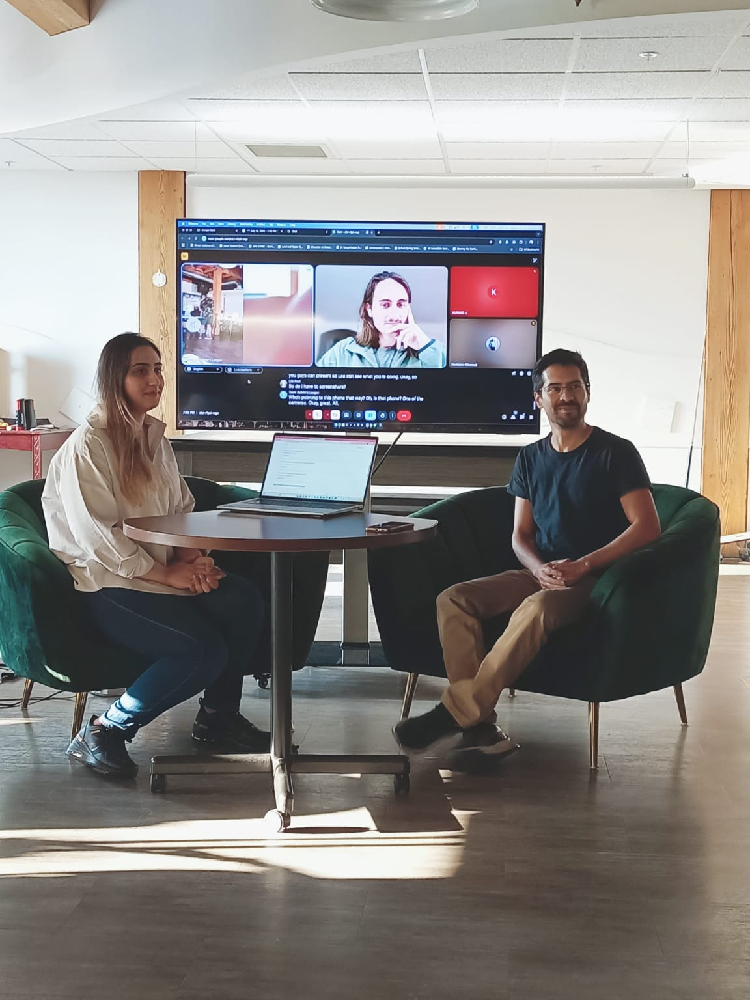

This week I attended two Builders League events. Both featured interesting setups and different approaches to the tech industry.

## Where We Pivot

This event focused on innovation, business development, and primarily web design. I learned about [U-Pro Soccer](https://www.uprosoccer.ca/), the technology they use and why they chose it, along with wonderful stories from founder John Barbosa. I had previously seen John presenting U-Pro Soccer and his journey at the Winnipeg MB Tech Week 2025 event "From Everywhere to Here: Newcomers Shaping Manitoba's Tech Ecosystem," and I was excited to see how the tech industry grows through struggles and resilience.

## Quest Nights

Quest Nights is about coding—bringing developers together to help build different apps. This time we continued developing the Community of Big Hearts app that was first built during the first Builders League Hackathon, an event I participated in. It was a great experience to collaborate with other developers, meet new people, and contribute to the community while learning.

I worked alongside [Ghazal](https://www.linkedin.com/in/ghazal-e-80727b2a1/) (check out her LinkedIn). We earned first place, secured a spot in the hot seat, and received feedback on our code from Lila Rest, a Silicon Valley engineer. It was quite the experience—I would definitely do it again.

