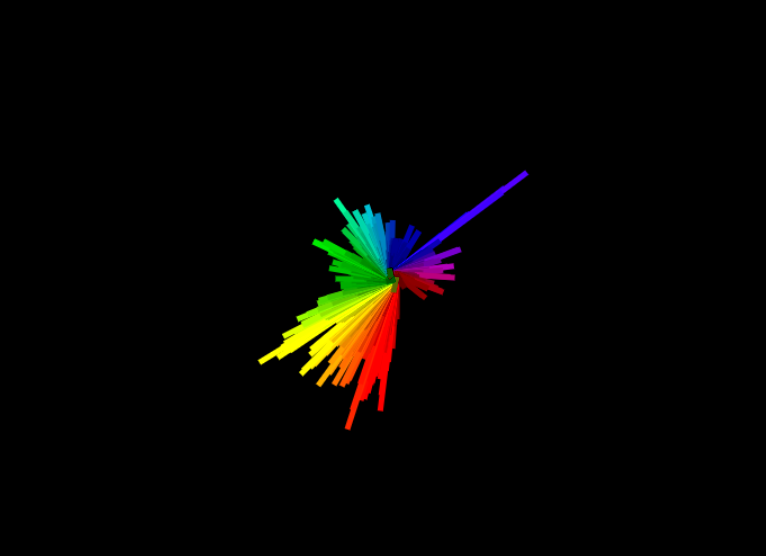

I find it interesting to get to know the dev community in Winnipeg. It sometimes feels like something completely foreign to me, but also very important for any future project. I know I want to build something on my own—a startup, a business, a SaaS—I just have that urge to create something. I knew what that "something" was back in Ecuador; my music studio was my business. But changes are what make life fun, however, they also come with a lot of scary and uncertain challenges.

I recently attended a Plugged In event organized by Tech Manitoba. In fact, it was my second Plugged In event. But I particularly enjoyed this one. It was about Career Pathing in Manitoba's Start-Up & Scale-Up Scene, featuring two inspiring founders, Klaudia McDonald and Matt Dirks, with lots of experience, positive and critical thinking—a truly valuable meeting.

It reaffirmed the idea of starting something, building something, creating and providing something of value. And that "something" again is what keeps me stuck. That "something" is what I feel the need to define, and sometimes it feels like it's being forced.

Since the beggining of the Full Stack Program I've been building apps or personal projects. Most ideas that to mind are related to  music,so the first app was an audio visualizer app.

Just fun getting access to the mic or playing a track and experimenting with forms and colors.

Mostly doing stuff with what I like, practicing, experimenting. Getting to develop and use the technology I've been learning, and hopefully finding what I want to build.
