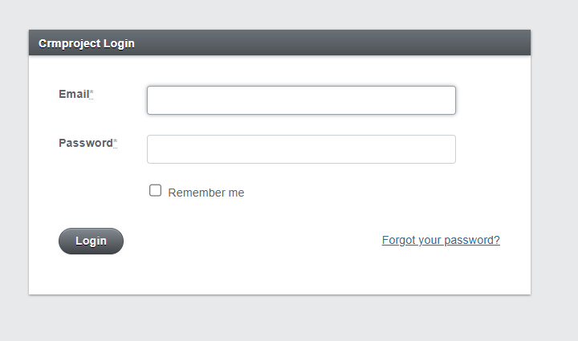

I was starting an app using Rails with Active Admin for an assignment, and I had some trouble configuring it. I searched on the web and it was hard to find useful information about this. So this is one of those times AI helps with debugging, especially when learning new languages and frameworks.

First, it was the basic gem setup as seen in the Active Admin website.
```bash
gem 'activeadmin'

# Plus integrations with:
gem 'devise'
gem 'cancancan'
gem 'draper'
gem 'pundit'
```

Bundle install, running the generator.
```bash
rails g active_admin:install
```
Migrate and seed the database. And that's it right? Running the server.
```bash
rails db:migrate
rails db:seed
rails server
```
But there was an error.
```
Propshaft::MissingAssetError in ActiveAdmin::Devise::Sessions#new

The asset 'active_admin.css' was not found in the load path.
```
At first I thought about changing the extension of the file from scss to css. But the problem was not the extension but that Rails uses Propshaft as the asset pipeline, while Active Admin uses Sprockets, which is older but stable.
So the best option was to use Sprockets.
```bash
gem 'sprockets-rails'
```
A bundle install and adding it in config/application.rb.
```bash
require "sprockets/railtie"
```
Now the server wouldn't start, but the error here was detailed. Just needed a manifest in the config folder.
```
Expected to find a manifest file in `app/assets/config/manifest.js`
(Sprockets::Railtie::ManifestNeededError)
But did not, please create this file and use it to link any assets that need
to be rendered by your app:

Example:
  //= link_tree ../images
  //= link_directory ../javascripts .js
  //= link_directory ../stylesheets .css
and restart your server
```
But I also added the active_admin assets.
```
//= link active_admin.css
//= link active_admin.js
```
Now the server started, but I was getting the same Propshaft error as at the beginning. I opted to comment out that gem in the Gemfile and run bundle install.
The error I got next was different, so at least I knew I was getting somewhere.
```
LoadError in ActiveAdmin::Devise::SessionsController#new
cannot load such file -- sassc
```
Now I would add the sassc gem and also precompile the assets and run the server.
```bash
rails assets:precompile
```
Don't forget to add the ransackable_attributes method to the admin_user model, and it should be working now.


I hope this helps someone in the future.