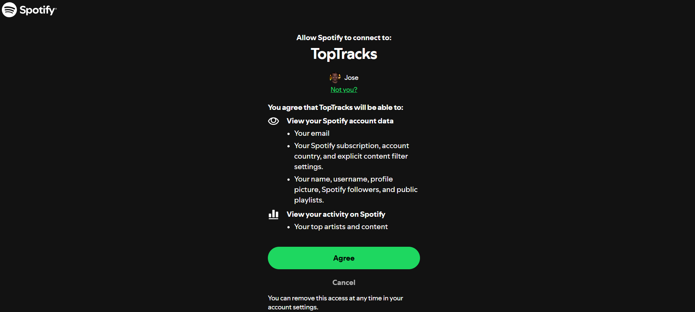
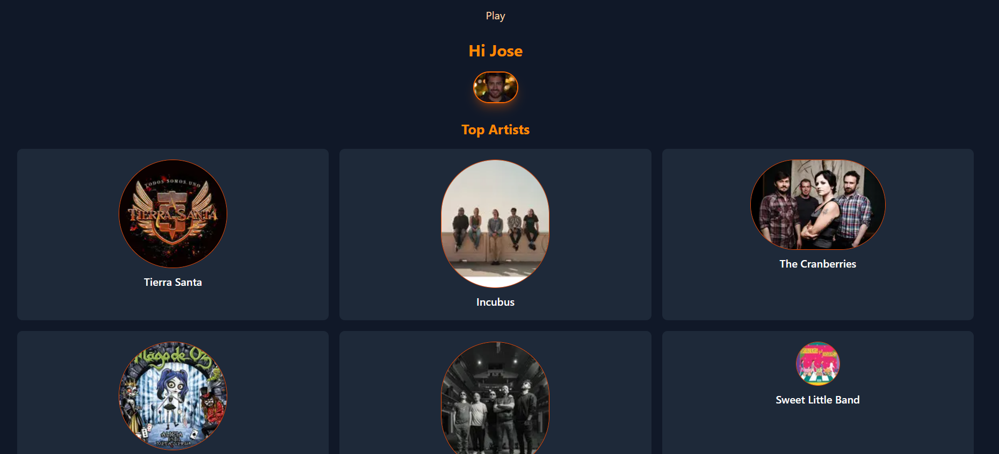
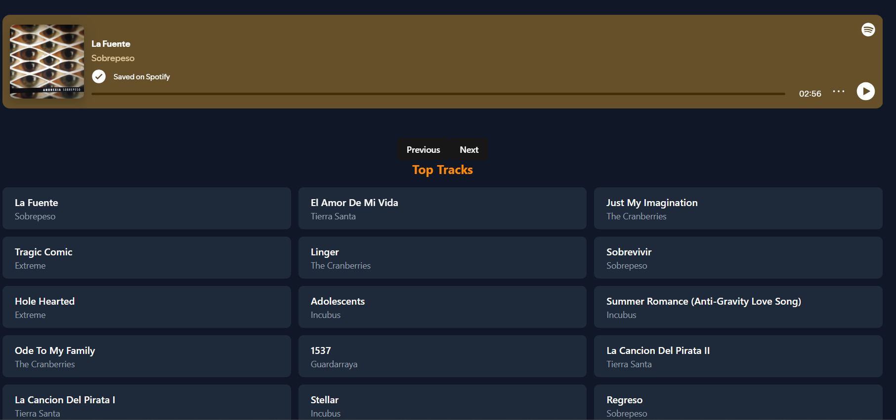
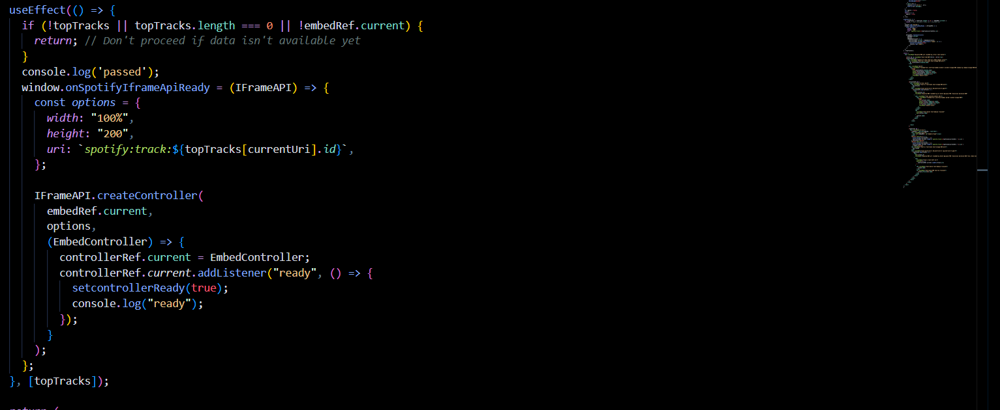
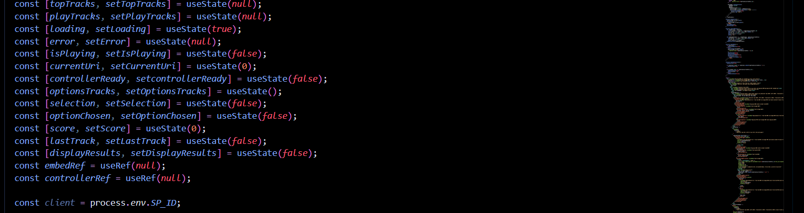
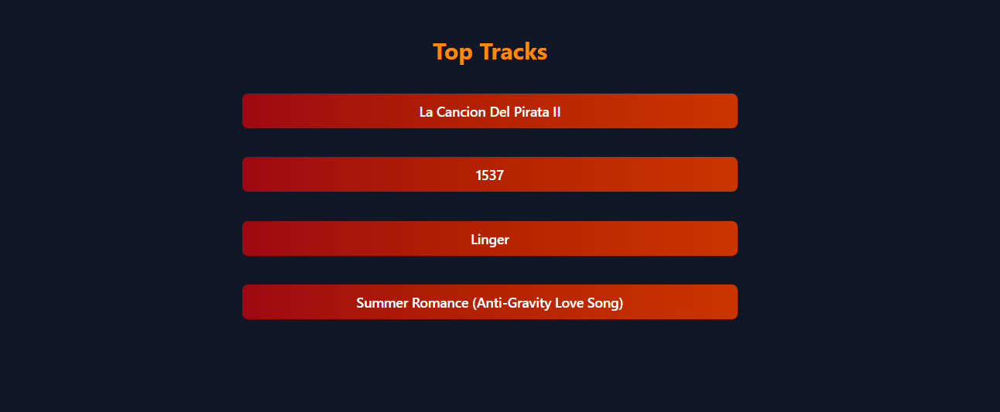
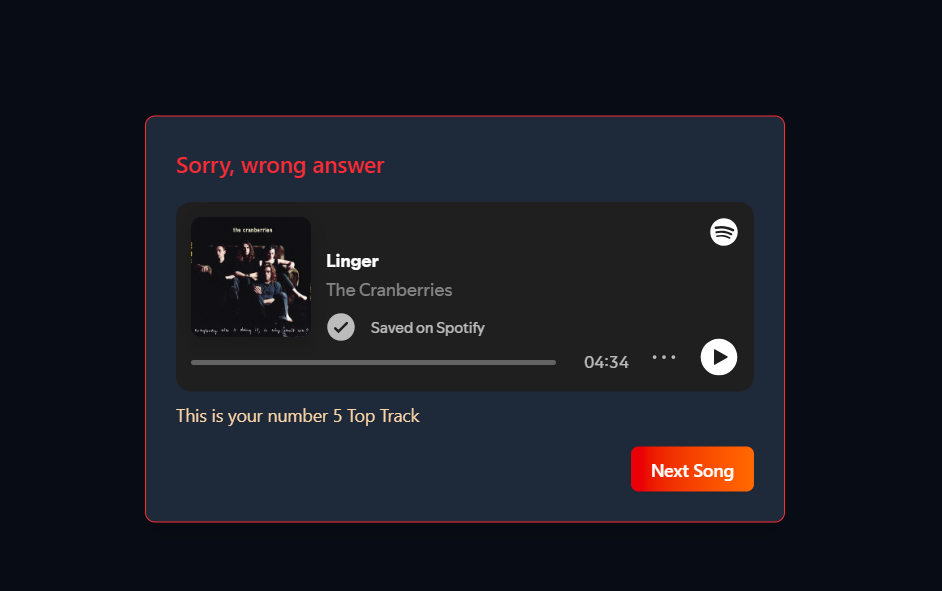
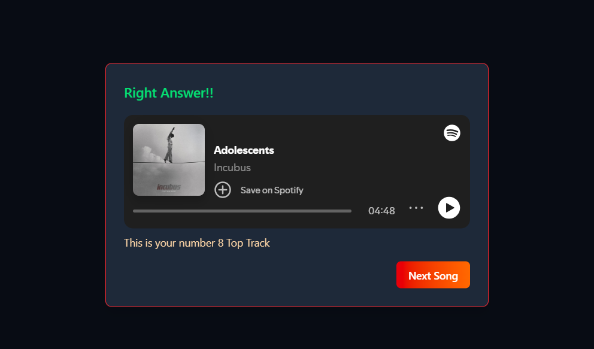
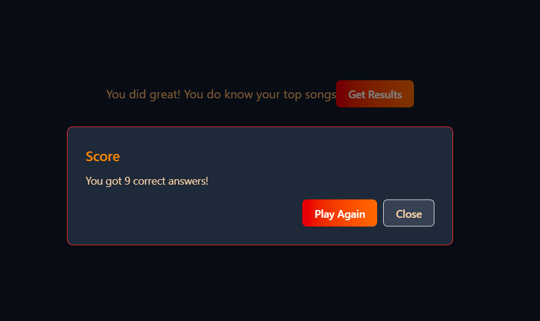

So, here is the first real thing I built. I wanted to see if I could fetch the Spotify API. It was my first time doing a fetch, generating a code verifier and a token.

[Music App](https://github.com/josedsegurav/musicapp) GitHub repo.



This time the documentation was easy to follow and understand. Once I had access, I could experiment. At first I just did a profile to display the top artists and top songs.



One of the first struggles was adding a player with the Iframe API. I used React and it was my first time actually using Next.js. It took a while to settle the server and client rendering knowledge I was getting. But I finally got it running.



It was great for practicing React, using hooks like useState, useRef and useEffect.



I always wanted to have a game to guess a song with just a few seconds of it. And so I got all these useState. Pretty sure I can optimize it 🤣



I already knew how to use the IFrame API for the player, and with some tweaking I got it right to run the game. First, I fetch the top songs the user has listened to in a 'medium term', that is like 6 months according to the Spotify API. I shuffled the array to get 10 random songs for the game.

I decided to do it this way to practice JavaScript functions like map and sort. But I consider the Fisher-Yates shuffle to be faster.

```js
let shuffledTracks = tracks.items
            .map((value) => ({ value, sort: Math.random() }))
            .sort((a, b) => a.sort - b.sort)
            .map(({ value }) => value)
            .slice(0, 10);
```
And after that it was basically UI work by building the cards the buttons.



Managing the events, displaying the messages and finally the results.







I have to say that I chose the color palette and built some components using shadcn. But I asked Claude for the styling. I focused on working and understanding how my app worked. I will be improving it someday, maybe.

Sadly, I can't make it available for everyone since I haven't ask for a quota extension on Spotify. Games are not allowed by Spotify 🤷🏽.